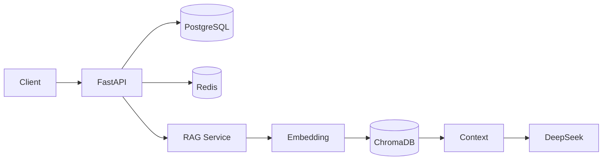
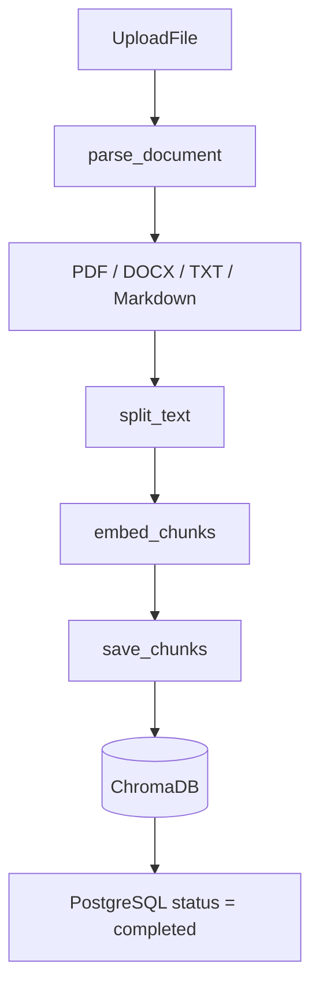
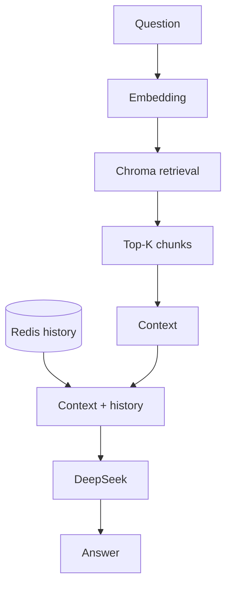

# SmartDoc-AI

SmartDoc-AI 是一个企业文档智能问答 / RAG backend。用户可以上传企业文档，系统完成文档解析、chunking、embedding 和 vector retrieval，再结合 DeepSeek 与会话历史生成回答。

## 项目特性

### 文档处理

- 支持 PDF、DOCX、TXT、Markdown
- 统一通过 `parse_document()` 解析为文本
- 通过 `split_text()` 切分文档，再生成 Embedding 并保存到 ChromaDB
- DOCX 当前提取普通段落和表格文本

### 文档管理

- Upload
- List
- Detail
- Update
- Delete

### RAG 问答

- Document parsing
- Text chunking
- `BAAI/bge-small-zh-v1.5` Embedding
- ChromaDB vector retrieval
- DeepSeek `deepseek-chat`

### Conversation

- Redis 保存会话消息
- 支持 multi-turn history
- 通过 TTL 自动过期，默认有效期为 3600 秒

### Engineering

- FastAPI
- PostgreSQL / SQLAlchemy
- Alembic migrations
- Global exception handling
- Logging
- pytest
- PostgreSQL integration tests
- GitHub Actions CI
- Docker / Docker Compose

## 技术栈

| 类别 | 技术 |
| --- | --- |
| Backend | FastAPI、Uvicorn、Python 3.11 |
| AI / RAG | Sentence Transformers、BAAI/bge-small-zh-v1.5、ChromaDB、DeepSeek |
| Database | PostgreSQL、SQLAlchemy、Alembic |
| Conversation | Redis |
| Infrastructure | Docker、Docker Compose |
| Testing | pytest、PostgreSQL integration tests、GitHub Actions |

## 系统架构



## 文档处理流程



实际处理过程中，系统会先创建 PostgreSQL 文档记录，完成解析、切分、Embedding 和 ChromaDB 保存后，再将文档状态更新为 `completed`。

## RAG 问答流程



聊天请求会先将用户消息写入 Redis，再读取 session history；RAG 检索得到的 context 与 history 一起构造 prompt，交给 DeepSeek 生成 answer。

## 项目目录

```text
.
├── .github/
│   └── workflows/
│       └── ci.yml
├── backend/
│   ├── app/
│   │   ├── api/
│   │   ├── core/
│   │   ├── db/
│   │   ├── exceptions/
│   │   ├── models/
│   │   ├── schemas/
│   │   └── services/
│   ├── alembic/
│   ├── tests/
│   │   └── integration/
│   ├── Dockerfile
│   ├── pytest.ini
│   └── requirements.txt
├── compose.yaml
└── README.md
```

## 快速启动：Docker Compose

前提：已安装并启动 Docker Desktop，且可使用 Docker Compose。

首次启动时，在项目根目录执行：

```powershell
Copy-Item .env.compose.example .env.compose
Copy-Item backend\.env.example backend\.env
```

然后根据模板填写 PostgreSQL 配置和 DeepSeek API key 等必要配置，不要将真实密码或 API key 提交到 Git。由于 `smartdoc_postgres_data` 是 external volume，首次启动前还需要创建一次：

```bash
docker volume create smartdoc_postgres_data
```

该 volume 一般只需首次创建一次。

在项目根目录执行：

```bash
docker compose up --build
```

Compose 会启动 `backend`、`postgres` 和 `redis`。Backend 容器启动后会先执行 Alembic migration，迁移成功后再启动 Uvicorn。

访问地址：

- FastAPI：<http://localhost:8000>
- Swagger：<http://localhost:8000/docs>

当前 Compose 端口映射：

- Backend：`localhost:8000` → `8000`
- PostgreSQL：`localhost:5433` → `5432`
- Redis：`localhost:6380` → `6379`

Backend 容器内部通过 `postgres:5432` 和 `redis:6379` 访问依赖服务。PostgreSQL 数据使用外部持久化 volume `smartdoc_postgres_data`；ChromaDB 数据通过 `./backend/chroma` 挂载到容器。

## 本地开发启动

从项目根目录创建并激活虚拟环境：

```bash
python -m venv venv
```

Windows PowerShell：

```powershell
.\venv\Scripts\Activate.ps1
```

安装 Backend 依赖并启动：

```bash
cd backend
python -m pip install -r requirements.txt
uvicorn app.main:app --reload
```

本地启动前请准备 `backend/.env`，并确保 PostgreSQL、Redis 和 DeepSeek 配置可用。

## 环境变量

应用配置由 `backend/app/core/config.py` 中的 Settings 管理，默认从当前运行目录的 `.env` 读取。

### `backend/.env`

本地 Backend 运行配置。仓库已提供不含真实密钥的 `backend/.env.example`，可按需复制后填写本地配置。

| 变量 | 必填 | 默认值 / 说明 |
| --- | --- | --- |
| `APP_ENV` | 否 | `development` |
| `LOG_LEVEL` | 否 | `INFO` |
| `DATABASE_URL` | 是 | PostgreSQL 连接 URL |
| `REDIS_HOST` | 否 | `localhost`；Compose 内由环境变量覆盖为 `redis` |
| `REDIS_PORT` | 否 | `6380`；Compose 内由环境变量覆盖为 `6379` |
| `REDIS_DB` | 否 | `0` |
| `DEEPSEEK_API_KEY` | 是 | DeepSeek API key，不应提交到 Git |
| `DEEPSEEK_BASE_URL` | 否 | `https://api.deepseek.com` |
| `EMBEDDING_MODEL` | 否 | `BAAI/bge-small-zh-v1.5` |
| `CHROMA_COLLECTION_NAME` | 否 | `smartdoc` |
| `SESSION_EXPIRE_SECONDS` | 否 | `3600` |

### `backend/.env.test`

仅用于 PostgreSQL integration tests。配置 `TEST_DATABASE_URL`，并指向独立的 `smartdoc_test` 数据库。仓库已提供 `backend/.env.test.example`。

### `.env.compose`

项目根目录下的 Compose 配置文件，用于提供 PostgreSQL 容器的 `POSTGRES_USER`、`POSTGRES_PASSWORD` 和 `POSTGRES_DB`。仓库已提供 `.env.compose.example`，请在本地填写实际值，不要将密码提交到 Git。

## 数据库迁移

数据库 schema 使用 Alembic 管理。进入 `backend` 目录后执行：

```bash
python -m alembic upgrade head
```

正式初始化和升级应使用 Alembic migration，不使用 `Base.metadata.create_all()` 代替迁移流程。Docker Compose 的 Backend 启动命令会自动执行 `python -m alembic upgrade head`。

## API

主要 API 如下：

| Method | Endpoint | Description |
| --- | --- | --- |
| `GET` | `/api/health` | Health check |
| `POST` | `/api/documents/upload` | 上传并处理文档 |
| `GET` | `/api/documents` | 分页查询文档列表 |
| `GET` | `/api/documents/{document_id}` | 查询文档详情 |
| `PUT` | `/api/documents/{document_id}` | 更新文档并重新处理 |
| `DELETE` | `/api/documents/{document_id}` | 删除文档及其向量 |
| `POST` | `/api/chat` | 基于文档 context 和会话历史进行问答 |

## Supported Document Formats

当前支持：

- PDF
- TXT
- Markdown
- DOCX

DOCX 当前支持提取：

- Paragraph text
- Table text

当前不支持：

- DOCX image OCR
- `.doc`
- Scanned PDF OCR

## Testing

在 `backend` 目录执行：

```bash
python -m pytest -m "not integration"
python -m pytest
```

当前测试套件共 50 个测试。integration tests 使用独立的 `smartdoc_test` PostgreSQL 数据库；测试通过 transaction rollback 清理测试数据，不保留测试记录。

## GitHub Actions CI

`.github/workflows/ci.yml` 在 push 和 pull request 时运行：

```text
push / pull request
        ↓
Ubuntu runner
        ↓
PostgreSQL 17 service
        ↓
安装 requirements.txt
        ↓
Alembic upgrade head
        ↓
pytest
```

当前 workflow 只执行 Backend 测试，没有声明 deploy 或 CD 流程。

## Docker

Docker Compose 当前管理以下服务：

- `backend`
- `postgres`
- `redis`

Backend 使用 `backend/Dockerfile` 构建，依赖来自 `backend/requirements.txt`。容器内通过服务名访问 `postgres:5432` 和 `redis:6379`；PostgreSQL 使用持久化 volume 保存数据。

## Known Limitations

- PostgreSQL 与 ChromaDB 之间没有分布式事务保证，跨存储操作失败时可能需要后续补偿或对账。
- ChromaDB 当前使用本地 persistent storage，主要面向单实例环境。
- DOCX 不解析图片文字。
- 扫描型 PDF 没有 OCR。
- Embedding model 初始化较重。

## Future Improvements

- Cross-storage compensation / reconciliation
- Lazy model initialization
- Docker image optimization
- OCR
- Production deployment
- Scalable vector database
